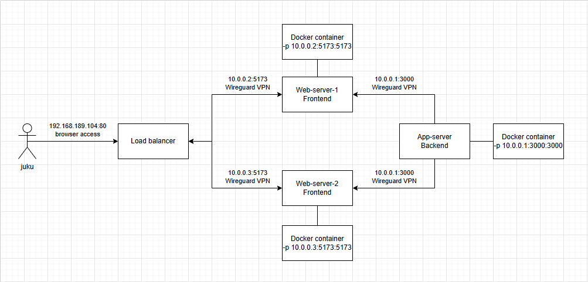

# Multi-Server Infrastructure Setup

## Overview

This project implements a containerized web application deployed across 5 Ubuntu VMs with load balancing, secure networking, and automated backups.

## Architecture

- **Application Server**: Backend container
- **Web Server 1 & 2**: Frontend containers
- **Load Balancer**: Nginx reverse proxy distributing traffic with round-robin load balancer
- **Backup Server**: Automated rsync backups of all servers

## Key Features

### 🔒 Security
- **WireGuard VPN** mesh network (10.0.0.x subnet)
- **UFW firewall** rules for service isolation
- **Fail2Ban** protection against brute-force attacks
- **SSH key authentication** for secure backups

### 🐳 Containerization
- **Docker containers** for frontend and backend services
- **Docker Compose** orchestration

### ⚖️ Load Balancing
- **Nginx upstream** configuration
- **Round-robin** traffic distribution

### 🔄 Backup System
- **Weekly automated backups** via cron
- **Rsync-based** `/etc` and `/home` directory backups
- **Interactive restore** script with date selection
- **Centralized backup storage** on dedicated server

### 📊 Monitoring
- **NetData** multi-node monitoring setup
- **Centralized logging** for all services
- **Container health** monitoring with Docker stats

## Technology Stack

- **OS**: Ubuntu (all VMs)
- **Containers**: Docker CE + Docker Compose
- **Load Balancer**: Nginx (bare metal)
- **VPN**: WireGuard
- **Backup**: Rsync + SSH keys
- **Monitoring**: NetData
- **Security**: UFW + Fail2Ban

## Network Diagram

## Setup tutorials

[Server & Container Setup](Tutorials/Server_setup.md)\
[Rsync Backup Setup](Tutorials/Rsync_backup.md)